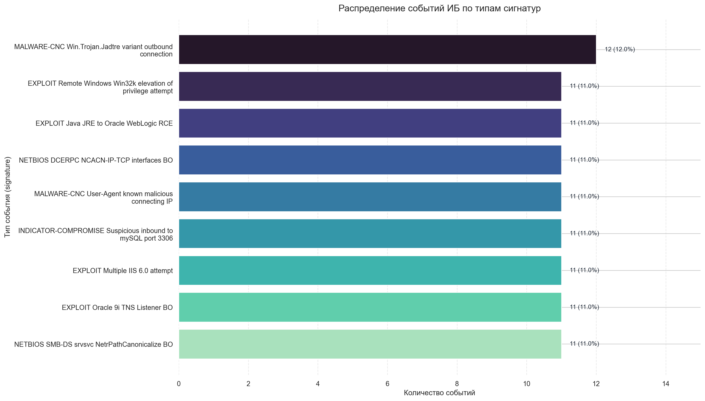

# Домашнее задание №9

## Тема
Python для аналитиков ИБ: API и анализ данных.

## Что сделано
1. Загружен набор событий из `events.json`.
2. Данные преобразованы в `DataFrame`.
3. Выполнен анализ распределения событий по полю `signature`.
4. Построен график распределения типов событий.
5. Итоговый график сохраняется в PNG-файл.

## Используемые библиотеки
- `pandas`
- `matplotlib`
- `seaborn`

## Структура проекта
- `events.json` - входные данные.
- `solution.py` - основной скрипт решения.
- `requirements.txt` - зависимости.
- `signature_distribution.png` - график распределения.

## Как запустить
```bash
python3 -m pip install -r requirements.txt
python3 solution.py --input events.json
```

## Дополнительные параметры
```bash
python3 solution.py \
  --input events.json \
  --plot-output signature_distribution.png \
  --show
```

## Что выводит скрипт
- Количество загруженных событий.
- Количество уникальных сигнатур.
- Таблицу распределения по `signature` в консоль.


## Итоговый график


## Примечание
Скрипт содержит валидацию входных данных:
- проверяет наличие ключа `events`;
- проверяет обязательные поля `timestamp` и `signature`;
- проверяет корректность дат и отсутствие пустых сигнатур.
